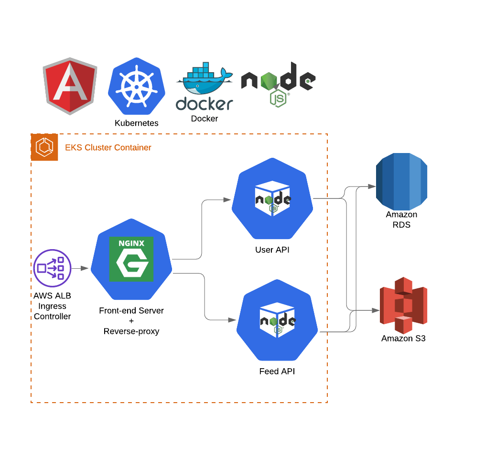

# Udagram Image Application

Udagram is a simple cloud application developed alongside the Udacity Cloud Engineering Nanodegree. It allows users to register and log into a web client, post photos to the feed. This project refactored the app to be deployed as microservices using Kubernetes. The previous version of the app used a monolith architecture.



## Architecture
The application has been divided into three service:
1. Front-end: an nginx server that serves static files for the front-end as well act as a reverse proxy for the backend services
2. Feed Backend: implements REST API for user feed. Communicates with postgresql database and S3 filestore to respond to the requests
3. User Backend: implements REST API for user management and login sessions. Uses JWT for authentication. Also communicates with the postgresql database to manage users.

## Additional files for deployment required
As the project is deployed to AWS EKS using kubernetes, it is required to create additional files that contain AWS project specific information, such as S3 Bucket name, account secret keys, RDS information etc.:
# aws-secret.yaml
```yaml
apiVersion: v1
kind: Secret
metadata:
  name: aws-secret
type: Opaque
data:
  credentials: __YOUR_AWS_CREDENTIALS_BASE64_ENCODED__
```
 
# env-config.yaml
```yaml
apiVersion: v1
kind: ConfigMap
data:
  AWS_BUCKET: __YOUR_AWS_BUCKET_NAME__
  AWS_PROFILE: __AWS_PROFILE__ (usually- default) 
  AWS_REGION: __YOUR_AWS_REGION__
  JWT_SECRET: hello
  POSTGRES_DB: __YOUR_DB_NAME__
  POSTGRES_HOST: __YOUR_POSTGRES_HOST_ADDRESS__
  URL: http://a7f0acf21b3744b1b83fcb838907ec7e-1126038356.eu-central-1.elb.amazonaws.com:8100   <---URL OF CREATED LOAD BALANCER
metadata:
  name: env-config
```

# env-secret.yaml
```yaml
apiVersion: v1
kind: Secret
metadata:
  name: env-secret
type: Opaque
data:
  POSTGRES_USERNAME: __POSTGRES_USERNAME_BASE64_ENCODED___
  POSTGRES_PASSWORD: __POSTGRES_PASSWORD_BASE64_ENCODED___
```

## Deployment using Kubernetes
The project has also been setup to be deployed on AWS using Kubernetes. All of the required manifests have been created in .k8s directory. The kubernetes deployment is made up of following components:
1. Back-end feed api deployment and internal service for it
2. Back-end user api deployment and internal service for it
3. Front-end + reverse proxy nginx server deployment and an external service to expose to internet
4. Ingress controller + ingress resource to load balance the incoming traffic

Once you have created a k8s cluster using AWS EKS service and setup the local k8s tools to communicate with the cluster, 
1. create k8s secrets to pass the sensitive information to the application:
    simply run the createSecrets.sh script inside the .k8s directory. All of the secret variables should already be present in your local dev environment. The pod deployment files are already created to pass these secrets as environment variables to the containers inside the pods.
2. Issue the commands to apply secret environment variables for kubernetes (These files are not included in the project):
    ```bash
    kubectl apply -f aws-secret.yaml
    kubectl apply -f env-config.yaml
    kubectl apply -f env-secret.yaml
    ```


3. issue the following commands from the project directory to deploy the whole application:
    ```kubectl apply -f .k8s```
